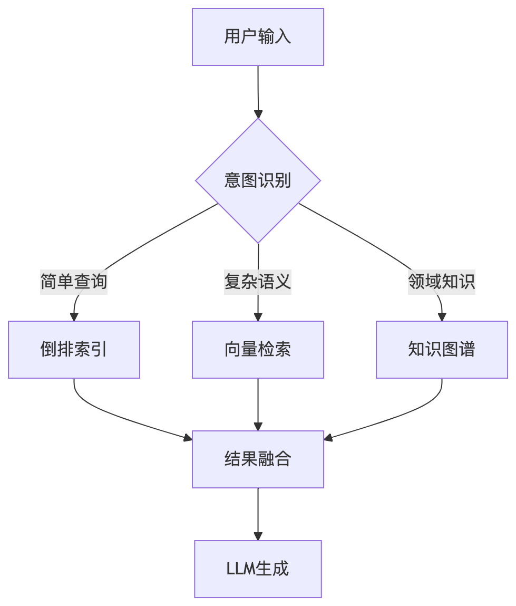

# IntelliSearch：基于AI大语言模型的对话式搜索引擎

## 项目简介

IntelliSearch 是一个基于AI大语言模型的对话式搜索引擎，旨在通过自然语言交互提升用户的信息检索体验。项目结合了大语言模型、搜索引擎和数据管理技术，开发了一个支持跨平台的智能搜索系统。通过创新的混合检索架构和检索增强生成（RAG）技术，IntelliSearch 能够提供更精准、更智能的搜索结果。

## 核心功能

* **对话式搜索** ：支持用户以自然语言输入查询，提供智能检索结果。
* **多模态交互** ：支持文本和图像搜索，满足多样化搜索需求。
* **数据管理** ：高效的数据存储和检索机制，保障数据隐私。
* **检索增强生成（RAG）** ：结合大语言模型与搜索引擎，生成结构化、高质量的答案。
* **跨平台客户端** ：基于Qt开发的用户友好界面，支持Windows、Linux、macOS。

## 项目特点

1. 模型支持：

* 集成主流大语言模型（如GPT-4、DeepSeek、Kimi等）。
* 本地化部署，保护用户数据隐私。

2. 搜索优化：

* **语义理解** ：基于BERT/ERNIE等模型实现意图识别和上下文理解。
* **混合检索** ：结合倒排索引、向量检索和知识图谱查询，提升搜索精度。
* **结构化生成** ：通过解析网页内容生成结构化答案，支持多轮对话和追问引导。
* **主动推荐** ：根据用户搜索历史和行为，推荐相关搜索内容。

3. 高效架构：

* **模块化设计** ：易于扩展和维护。
* **容器化部署** ：使用Docker支持多环境运行。
* **高性能存储** ：结合SQLite和Redis，实现高效数据管理。


## 项目结构

```plaintext
IntelliSearch/
├── client/                 # 客户端模块
│   ├── CMakeLists.txt      # 客户端构建配置
│   └── src/                # 客户端源代码
│       ├── SearchBridge    # 搜索桥接器
│       ├── main.cpp        # 主程序入口
│       └── resources/      # 资源文件
│
├── config/                 # 配置管理模块
│   ├── ConfigManager       # 配置管理器
│   ├── config.json         # 主配置文件
│   └── IntentParserPrompt  # 意图解析提示配置
│
├── core/                   # 核心功能模块
│   ├── api/               # API服务层
│   │   ├── APIService     # API服务接口
│   │   ├── BaseAPIService # 基础API服务
│   │   └── KimiAPIService # Kimi API实现
│   ├── engine/            # 搜索引擎核心
│   │   └── IntentParser   # 意图解析器
│   └── utils/             # 工具类
│
├── data/                   # 数据管理模块
│   ├── cache/             # 缓存管理
│   ├── crawler/           # 数据爬虫
│   └── database/          # 数据库管理
│       └── DatabaseManager # 数据库管理器
│
├── docs/                   # 项目文档
│   ├── CodeStandard.md    # 代码规范
│   ├── clientDoc.md       # 客户端文档
│   └── spdlogGuide.md     # 日志指南
│
├── log/                    # 日志模块
│   ├── Logger.cpp         # 日志实现
│   └── Logger.h           # 日志接口
│
└── tests/                  # 测试模块

```

## 检索流程



## 技术栈

* 编程语言：C++、Python
* 前端框架：Qt
* 数据库：SQLite、Redis

## 安装与运行

1. 环境准备

   * 操作系统：支持Windows、Linux、macOS
   * 必备工具：

     * C++编译器（支持C++17及以上）
     * Qt框架
     * Python 3.8+
2. 克隆项目

   ```shell
   git clone https://github.com/your_username/IntelliSearch.git
   cd IntelliSearch
   ```
3. 本地运行：

   ```
   cd client/
   mkdir build && cd build
   cmake .. && make
   ./IntelliSearch
   ```

## 演示截图


## 开源协议

本项目遵循 MIT License 开源协议。
